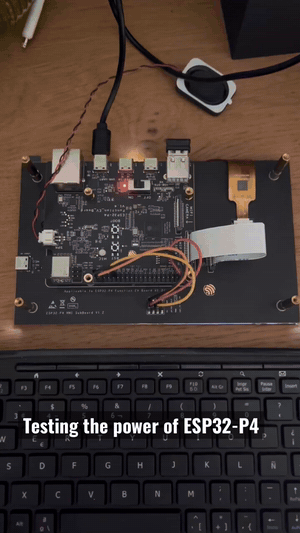

# OpenLara for ESP32-P4 and ESP32-S31

A port of [OpenLara](https://github.com/XProger/OpenLara) to the **ESP32-P4-Function-EV-Board** and **ESP32-S31-Korvo-1**.
It runs the classic Tomb Raider 1 engine with software rendering, audio, and USB HID keyboard input on Espressif's latest RISC-V SoCs.

**Author:** [Alejandro Villegas Alonso](https://www.linkedin.com/in/alejandro-villegas-alonso-825041b1/)

## Features

- Software RGB565 renderer at 320x240, hardware-scaled via the PPA to 1024x600 (P4) or 800x480 (S31)
- 44.1 kHz stereo audio via I2S + ES8311 (P4) or ES8389 (S31)
- USB HID keyboard input (boot protocol)
- On-screen touch controls via GT911 (P4) or GT1151 (S31), enabled by default
- MicroSD card (SDMMC 4-bit) for game data
- MP3 (minimp3), OGG (stb_vorbis) and zlib (tinf) decode support
- On-screen FPS counter (F12 toggle)


## Demo



## Hardware Requirements

| Component | ESP32-P4-Function-EV-Board     | ESP32-S31-Korvo-1               |
| --------- | ------------------------------ | ------------------------------- |
| SoC       | ESP32-P4                       | ESP32-S31                       |
| Flash     | 16 MB                          | 16 MB                           |
| PSRAM     | 32 MB HEX                      | 16 MB OCT                       |
| Display   | 1024x600 MIPI DSI EK79007      | 800x480 RGB565 LCD              |
| Audio     | ES8311 via I2S STD             | ES8389 via I2S TDM              |
| Storage   | MicroSD, SDMMC 4-bit           | MicroSD, SDMMC 4-bit            |
| Input     | USB HID keyboard / GT911 touch | USB HID keyboard / GT1151 touch |

## Building

### Prerequisites

- ESP-IDF
  - v5.4+ for ESP32-P4 (tested with v5.4.4 / v5.5.5 / v6.1)
  - v6.1+ for ESP32-S31 (tested with [`c712a0dd`](https://github.com/espressif/esp-idf/commit/c712a0dde385d659a1470a136251980d31a70bc1))
- `riscv32-esp-elf` toolchain

### Build & Flash

```bash


# Set Target (ESP32-P4-Function-EV-Board)
idf.py set-target esp32p4
# Hint:
# If you are using P4 Rev 3+,
# uncheck `ESP32P4_SELECTS_REV_LESS_V3` in `idf.py menuconfig`

# Set Target (ESP32-S31-Korvo-1)
# idf.py --preview set-target esp32s31

# Build
idf.py build

# Flash (adjust port as needed)
idf.py -p /dev/ttyUSB0 flash monitor
```

## Game Data

You must provide your own **Tomb Raider 1** data files (`.PHD` levels, `.PCX` images, cutscenes) inside a **`DATA`** folder on the MicroSD card. The game will not run without them.

Copy the directory as follows, preserving uppercase filenames and directory names:

```text
<SD card root>/
└── DATA/
    ├── GYM.PHD
    ├── TITLE.PHD
    ├── TITLEH.PCX
    └── ... other game data files
```

## Controls

Use a USB keyboard or the built-in touchscreen.

### Touchscreen Controls

`idf.py menuconfig` → **OpenLara controls** → **Enable touchscreen game controls**
enables touchscreen initialization and input. It is enabled by default. If the
touch controller fails to initialize, the game continues with USB keyboard input.

Touchscreen controls divide the screen into movement (left), camera/look
(middle), and action buttons (right). The right-side buttons handle weapon, walk,
action, jump, and inventory. A double tap in the movement area rolls. Multiple
fingers can be used together.

> [!TIP]
>
> When touchscreen game controls are enabled, press the development board's
> **BOOT** button to show or hide the on-screen controls.

### USB Keyboard

For the ESP32-P4-Function-EV-Board, connect the USB keyboard to the port labeled
**USB-HS**.

For the ESP32-S31-Korvo-1, connect the USB keyboard to the port labeled
**USB 2.0**.

The following are the default USB keyboard bindings; they can be changed in the
in-game control settings.

| Key                | Action                              |
| ------------------ | ----------------------------------- |
| Arrow keys         | Movement                            |
| C                  | Look / camera                       |
| Ctrl               | Action (grab, interact)             |
| Shift              | Walk                                |
| Alt                | Jump                                |
| Space              | Draw weapon                         |
| Z                  | Duck                                |
| X                  | Dash                                |
| A                  | Roll                                |
| Escape             | Inventory                           |
| Enter              | Start / add second player           |
| Shift + Left/Right | Step left/right                     |
| 5                  | Save game                           |
| 9                  | Load game                           |
| H                  | Show or hide help                   |
| R / T              | Slow motion / fast motion           |
| F12                | Toggle FPS counter                  |

## Technical Notes

- Software rendering is based on the **MS-DOS** flavor of OpenLara (not the GL renderer), using the header-only `gapi/sw.h` engine compiled as C++11
- Near-plane clipping patch applied for the software renderer
- FreeRTOS dual-core with a 1000 Hz tick; the audio pump task runs on core 0
- All game memory is allocated from PSRAM; internal SRAM is reserved for DMA and task stacks
  - S31 also puts the large game task stack in PSRAM to leave internal SRAM for DMA
- Saves and cache are written to the SD card

## Credits

- [XProger/OpenLara](https://github.com/XProger/OpenLara) — the original open-source Tomb Raider 1 engine

## License

This port is based on [OpenLara](https://github.com/XProger/OpenLara), licensed under the [BSD-2-Clause](https://github.com/XProger/OpenLara/blob/master/LICENSE).
